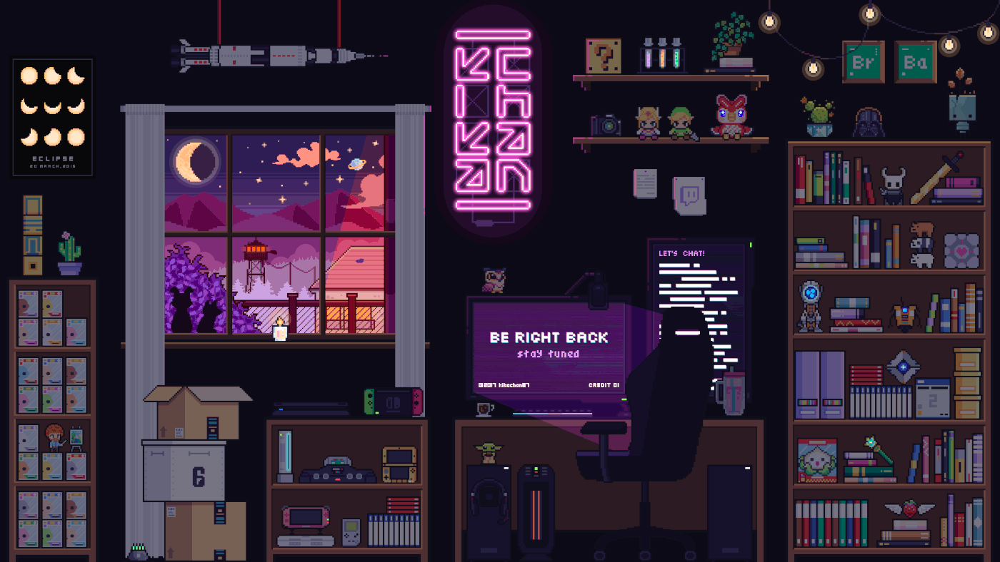

 

  

###

<h1 align="center">Привет
 Меня зовут Александр!</h1>
 
###

<h3 align="center">Backend Developer | 4+ лет коммерческого опыта</h3>

  
  <a href="https://t.me/Mrklv001" target="_blank">
  
  

###

<h3 align="left">👨‍💻 Обо мне</h3>

Backend-разработчик с фокусом на <b>FastAPI</b>, асинхронных интеграциях и высоконагруженных системах.  Работал в <b>финтехе</b> (Квантрон) и <b>медицинском домене</b> (СЭМП, МИС Самсон).

 

<h3>📈 Что умею — в цифрах:</h3>
<ul>
  <li> ⚡ Снизил задержки API с <b>900 мс → 400–500 мс</b> через переход на async + RabbitMQ</li>
  <li> 📄 Автоматизировал обработку <b>200+ документов/мес</b> (было ~0% автоматизации → стало 80%+)</li>
  <li> 🏥 Впервые подключил учреждение к федеральной системе СЭМП — <b>100+ врачей</b> получили доступ к данным в реальном времени</li>
  <li>🔧 Сократил время диагностики инцидентов с <b>нескольких часов → 30–60 минут</b> через централизованное логирование</li>
</ul>

Увлекаюсь низкоуровневыми системами: реализую Redis, Git, HTTP-сервер и DNS с нуля — это помогает понимать инструменты, которыми пользуюсь каждый день.
 
 🎓 Магистр ИТМО (Инноватика, 2024), аспирант ЛЭТИ
 📍 Санкт-Петербург, готов к удалённой работе и командировкам
 🌐 Английский B2
 🚀 Участвовал в конкурсе IT-стартапов.

###

 

###

<h2 align="center">🧠 Технологический стек:</h2>

### 👨‍💻 Языки программирования

### ⚙️ Фреймворки

### 🗄 Базы данных и кэш

### 🧩 ORM и работа с БД

### 📨 Брокеры сообщений и фоновые процессы

### 🧪 Тестирование

### 🚀 DevOps, CI/CD, Environment

###

<h2 align="center">🧠 Решение задач</h2>
 

<!-- Codewars & LeetCode-->

  

###